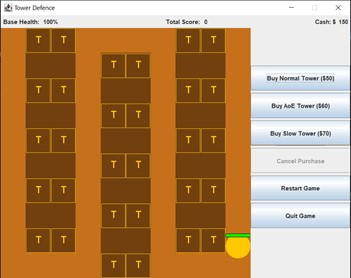
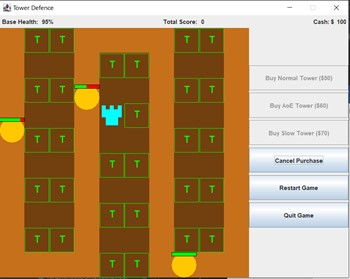
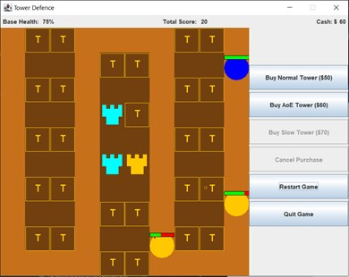
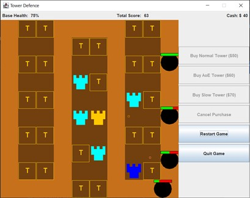
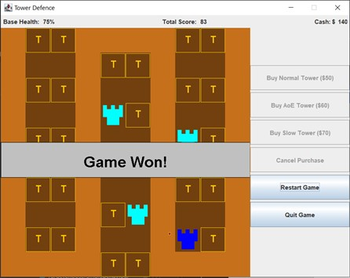
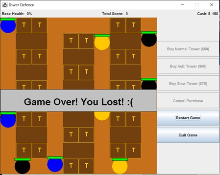

# 1.1 Tower Defence Game Clone Overview

**Overview written by Peter Mitchell.**

## Contents

```
1.1 Tower Defence Game Clone Overview 
1.2 Introduction
1.3 The Rules of Tower Defence 
1.4 High Level Discussion About Implementation 
1.5 How the Core Game Works
1.6 Features You Could Add 
```
# 1.2 Introduction

This document will explain the fundamentals of how the Tower Defence game works. 

# 1.3 The Rules of Tower Defence

A tower defence game has a simple set of rules, but they can be very varied and complex depending
on implementation. The following are some of the general rules of what makes a tower defence game.

- The player controls towers that can be purchased using currency. They may range in function
    to provide different utility or strength. The towers fire projectiles based on nearby enemies.
- Enemies may have varying types. The enemy goal is to move through the maze to an end point
    where they damage your base.
- Destroying an enemy with your towers before it reaches their end goal awards the player with
    score and currency to purchase more towers.
- Enemies spawn as a set of waves that must all be defeated to complete the game.


# 1.4 High Level Discussion About Implementation

In this section the game content will be described briefly mostly by showing image examples of
gameplay. To start with the scene below is what you would see at the beginning of a game. You start
the game with no towers placed. Some initial cash to spend (see top right), and you can see the first
enemy spawned as the circle with a health bar above it. The buttons on the right control creation of
the towers and resetting/quitting the game.



Pressing any of the button to buy a tower will disable all the buttons for buying and make the cancel
button become available as seen below. All the places where a tower can be placed will change to
show green Ts. Click any of these to place the tower.



You can see in the image below that depending on your available cash some options may be disabled.
If you do not have enough cash to purchase any of the towers the option to purchase those becomes
disabled. In the image below you can see two of the different types of enemies. The orange enemies
are the normal enemies that move at a medium speed and have medium health. The blue enemy has
fast speed and low health. The third type of enemy you will see in future images is the boss as a black
enemy with slow speed and high health.



Below you can see examples of these boss enemies. Along with all the different types of towers. The
teal coloured towers are the normal towers. They fire at the closest target dealing damage at frequent
intervals. The orange towers fire slower at single close enemies dealing AoE damage to all enemies
around the target. The navy blue tower is a slow tower that will fire slowing debuffs at all nearby
enemies in range.





If all the waves are survived the game is won as seen above. Or if you lose all base health by letting
the enemies reach the end the game is lost as seen below.




# 1.5 How the Core Game Works

For full details about each class, you can go and read the detailed comments provided in each
individual class. This section will just briefly summarise the purpose of each class separating them into
categories.

Utility Classes:

- ActionTimer: Represents a timer that triggers after a period of time. Used to keep track of
    many of the different timers that are throughout the game.
- DoublePosition and Position: Two representations of the Position object one that uses int
    types and one that uses double types. The doubles were necessary for some of the projectile
    movement to handle unit vectors that are not straight lines.
- Rectangle: A simple rectangle representing a position with a width and height.

Towers and the Map:

- Map: Stores a collection of MapObjects and all the towers that have been placed.
- MapObject: An object that is either empty or raised to show a wall blocking the enemies.
- Projectile: Fired by the towers at enemy units.
- Tower: Represents the individual tower.
- TowerPlacementObject: A specific type of MapObject that represents somewhere a tower can
    be placed.

Tower AI:

- TowerAI: Contains utility methods to help the tower AI work.
- AttackTargetBehaviour: An interface to define how towers apply attacks to targets.
- TargetChooserBehaviour: An interface to define how towers choose their targets.
- AttackAoEAtTargetBehaviour: An implementation of the AttackTargetBehaviour that will
    damage all enemies around the enemy that is hit by a projectile fired by this attack.
- AttackSingleTargetBehaviour: An implementation of the AttackTargetBehaviour that will
    damage a single enemy when a projectile hits.
- AttackSlowTargetBehaviour: An implementation of the AttackTargetBehaviour that will apply
    a slow debuff to the enemies when they are hit.
- TargetChooserAllInRangeBehaviour: An implementation of the TargetChooserBehaviour that
    will return all targets that are within the towers range.
- TargetChooserSingleBehaviour: An implementation of the TargetChooserBehaviour that will
    return just the closest target in range.

Enemies:

- AIWaypoint: Used to store a single point of the sequence of positions an AI will move through
    while alive. Points toward the next AIWaypoint as a linked list type structure.
- Debuff: Debuffs can be applied to enemies by the tower attacks. Currently there is just a slow
    effect and the management of this is controlled by the EnemyUnit.
- EnemyUnit: Defines a single enemy that will try and move between AIWaypoints.
- EnemyUnitManager: Controlls all the enemy units and keeps a list of the AIWaypoints to pass
    to the enemies as they are created.
- HealthBar: Defines a simple visual representation of the health as a percent filled bar used by
    the Enemy Unit.
- SpawnCommand: An individual command used by the SpawnManager to either spawn an
    enemy or change the time between enemy spawns.
- SpawnManager: A manager object controlled by the EnemyUnitManager to control spawning
    of the enemies based on a list of SpawnCommands.

Interface and Panels:

- BuyTowerPanel: Is the panel on the right side that shows the buttons for buying towers,
    restarting the game, and quitting.
- Game: The class controlling the JFrame and is responsible for starting the game.
- GamePanel: Controls the overall game state managing all the other game elements.
- StatusPanel; Is the panel at the top of the screen showing status information indicating how
    much health the base still has, how much score has been achieved, and how much cash is
    controlled.

# 1.6 Features You Could Add

There are many improvements that could be made to turn this already complex set of classes into an
even more engaging game. Currently it is in a very prototype form and could be transformed into
something much more challenging.

- Modify the many different tuning knobs to make the game more engaging. Currently the game
    uses a small number of simple enemies. The stats of the enemies or towers could be modified.
    Additionally, any of the timers, and how the behaviours work.
- Add new types of behaviours for additional types of towers. You could also modify the way
    projectiles move to make some of them curve toward the target instead of flying straight.
- You could make types of enemies that can damage the towers and destroy them.
- You could add multiple levels, perhaps with a level select screen or transitions to levels as you
    complete each one.
- Try with different configurations of the spawn manager to spawn at different frequencies and
    different types of enemies to add a ramping level of difficulty.
- Improve the visuals of the game. Everything at the moment is very plain and could use some
    work on making it look nicer.
- Look at other existing tower defence games and try to implement a feature in those games in
    this one.
- Come up with your own unique feature and add it to the game.


